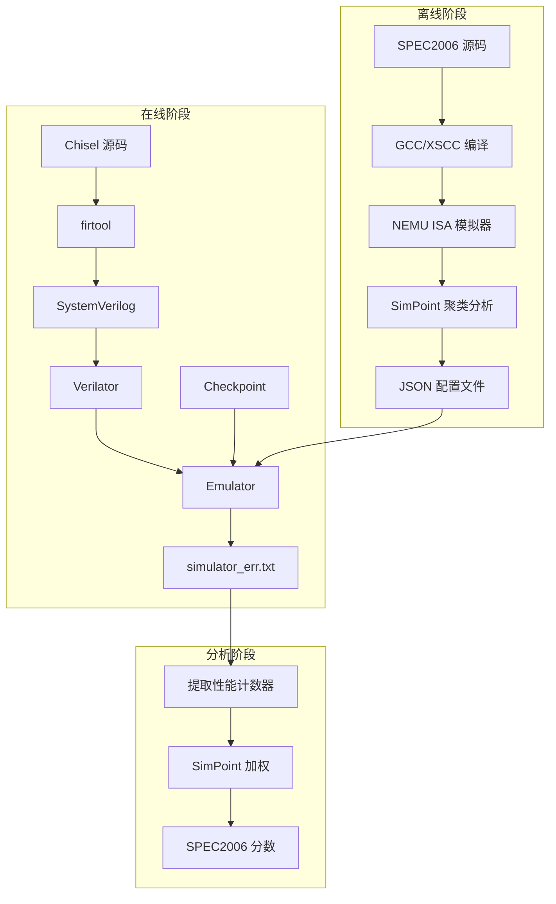
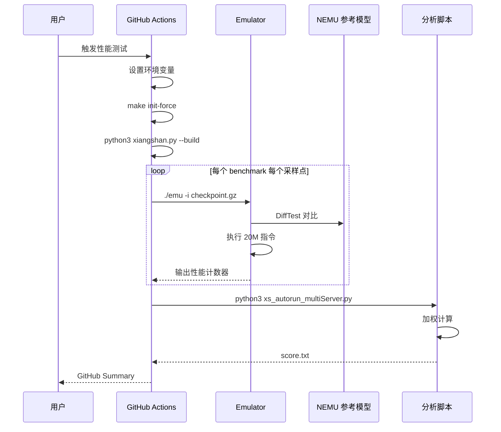

# XiangShan SimPoint 评估框架架构图

> 本文档包含 XiangShan SimPoint 评估框架的架构图和数据流图。

---

## 1. 整体架构图

### 1.1 组件关系图

```
┌─────────────────────────────────────────────────────────────────────────────────┐
│                        XiangShan SPEC2006 评估框架                               │
├─────────────────────────────────────────────────────────────────────────────────┤
│                                                                                 │
│  ┌──────────────────┐    ┌──────────────────┐    ┌──────────────────┐         │
│  │   Chisel 源码    │    │   Checkpoint     │    │   SimPoint       │         │
│  │   (RTL 设计)     │    │   (NEMU 生成)    │    │   配置 (JSON)    │         │
│  └────────┬─────────┘    └────────┬─────────┘    └────────┬─────────┘         │
│           │                       │                       │                    │
│           ▼                       │                       │                    │
│  ┌──────────────────┐             │                       │                    │
│  │   firtool        │             │                       │                    │
│  │   (Chisel→SV)   │             │                       │                    │
│  └────────┬─────────┘             │                       │                    │
│           │                       │                       │                    │
│           ▼                       │                       │                    │
│  ┌──────────────────┐             │                       │                    │
│  │   SystemVerilog  │             │                       │                    │
│  │   (SimTop.sv)    │             │                       │                    │
│  └────────┬─────────┘             │                       │                    │
│           │                       │                       │                    │
│           ▼                       ▼                       │                    │
│  ┌──────────────────────────────────────────┐             │                    │
│  │            Verilator                      │             │                    │
│  │   (SV → C++ 编译)                        │             │                    │
│  └────────────────┬─────────────────────────┘             │                    │
│                   │                                       │                    │
│                   ▼                                       │                    │
│  ┌──────────────────────────────────────────┐             │                    │
│  │         DiffTest 框架                     │             │                    │
│  │  ┌─────────────┐  ┌─────────────┐        │             │                    │
│  │  │ 内存模型    │  │ 设备模型    │        │             │                    │
│  │  │ (ram.cpp)   │  │ (device.cpp)│        │             │                    │
│  │  └─────────────┘  └─────────────┘        │             │                    │
│  │  ┌─────────────┐  ┌─────────────┐        │             │                    │
│  │  │ Emulator    │  │ NEMU 参考   │        │             │                    │
│  │  │ (emu.cpp)   │  │ (ref proxy) │        │             │                    │
│  │  └─────────────┘  └─────────────┘        │             │                    │
│  └────────────────┬─────────────────────────┘             │                    │
│                   │                                       │                    │
│                   ▼                                       ▼                    │
│  ┌──────────────────────────────────────────────────────────────────────────┐  │
│  │                        Emulator 可执行文件 (emu)                          │  │
│  │                                                                          │  │
│  │   输入:                                                                  │  │
│  │   - Checkpoint 文件 (.gz/.zstd)                                          │  │
│  │   - DiffTest 参考模型 (riscv64-nemu-interpreter-so)                      │  │
│  │   - 最大指令数 (--max-instr)                                             │  │
│  │                                                                          │  │
│  │   输出:                                                                  │  │
│  │   - simulator_err.txt (性能计数器)                                       │  │
│  │   - simulator_out.txt (执行日志)                                         │  │
│  └──────────────────────────────────┬───────────────────────────────────────┘  │
│                                     │                                          │
│                                     ▼                                          │
│  ┌──────────────────────────────────────────────────────────────────────────┐  │
│  │                        分析脚本                                           │  │
│  │                                                                          │  │
│  │  ┌─────────────────┐  ┌─────────────────┐  ┌─────────────────┐         │  │
│  │  │ top_down.py     │  │ configs.py      │  │ draw.py         │         │  │
│  │  │ (加权计算)      │  │ (计数器定义)    │  │ (可视化)        │         │  │
│  │  └────────┬────────┘  └────────┬────────┘  └────────┬────────┘         │  │
│  │           │                    │                    │                    │  │
│  │           └────────────────────┼────────────────────┘                    │  │
│  │                                ▼                                          │  │
│  │                    ┌───────────────────────┐                             │  │
│  │                    │  SPEC2006 分数        │                             │  │
│  │                    │  - SPECint2006/GHz    │                             │  │
│  │                    │  - SPECfp2006/GHz     │                             │  │
│  │                    │  - SPEC2006/GHz       │                             │  │
│  │                    └───────────────────────┘                             │  │
│  └──────────────────────────────────────────────────────────────────────────┘  │
│                                                                                 │
└─────────────────────────────────────────────────────────────────────────────────┘
```

### 1.2 数据流图

```
┌─────────────────────────────────────────────────────────────────────────────────┐
│                              数据流图                                            │
├─────────────────────────────────────────────────────────────────────────────────┤
│                                                                                 │
│  [离线阶段：一次性]                                                              │
│                                                                                 │
│  SPEC2006 源码                                                                   │
│       │                                                                         │
│       ▼                                                                         │
│  ┌─────────────┐     ┌─────────────┐     ┌─────────────┐                       │
│  │ GCC/XSCC    │────▶│ NEMU        │────▶│ SimPoint    │                       │
│  │ 编译器      │     │ ISA 模拟器  │     │ 聚类分析    │                       │
│  └─────────────┘     └─────────────┘     └──────┬──────┘                       │
│                                                  │                              │
│                                                  ▼                              │
│                           ┌─────────────────────────────────────┐              │
│                           │  SimPoint 配置 (JSON)                │              │
│                           │  {                                  │              │
│                           │    "benchmark": {                   │              │
│                           │      "insts": "总指令数",           │              │
│                           │      "points": {                    │              │
│                           │        "地址": "权重", ...          │              │
│                           │      }                              │              │
│                           │    }                                │              │
│                           │  }                                  │              │
│                           └─────────────────────────────────────┘              │
│                                                                                 │
│  [在线阶段：每次评估]                                                            │
│                                                                                 │
│  ┌─────────────────────────────────────────────────────────────────────────┐   │
│  │                        Emulator 执行流程                                 │   │
│  │                                                                         │   │
│  │  ┌───────────────┐     ┌───────────────┐     ┌───────────────┐         │   │
│  │  │ 1. 加载       │     │ 2. 恢复       │     │ 3. 执行       │         │   │
│  │  │    Checkpoint │────▶│    CPU 状态   │────▶│    指令       │         │   │
│  │  │    (.gz)      │     │    + 内存     │     │    (--max-instr)│        │   │
│  │  └───────────────┘     └───────────────┘     └───────┬───────┘         │   │
│  │                                                       │                 │   │
│  │                                                       ▼                 │   │
│  │                                               ┌───────────────┐         │   │
│  │                                               │ 4. 输出       │         │   │
│  │                                               │    性能计数器 │         │   │
│  │                                               │    (stderr)   │         │   │
│  │                                               └───────┬───────┘         │   │
│  └───────────────────────────────────────────────────────┼─────────────────┘   │
│                                                          │                     │
│                                                          ▼                     │
│  ┌─────────────────────────────────────────────────────────────────────────┐   │
│  │                        分析阶段                                          │   │
│  │                                                                         │   │
│  │  simulator_err.txt                                                      │   │
│  │       │                                                                 │   │
│  │       ▼                                                                 │   │
│  │  ┌───────────────┐     ┌───────────────┐     ┌───────────────┐         │   │
│  │  │ 提取          │     │ 加权平均      │     │ 计算          │         │   │
│  │  │ 性能计数器    │────▶│ (SimPoint     │────▶│ SPEC 分数     │         │   │
│  │  │ (IPC, Stall)  │     │  权重)        │     │               │         │   │
│  │  └───────────────┘     └───────────────┘     └───────────────┘         │   │
│  │                                                                         │   │
│  └─────────────────────────────────────────────────────────────────────────┘   │
│                                                                                 │
└─────────────────────────────────────────────────────────────────────────────────┘
```

---

## 2. Checkpoint 结构图

### 2.1 GCPT 文件格式

```
┌─────────────────────────────────────────────────────────────────────────────────┐
│                          GCPT (Golden Checkpoint) 格式                           │
├─────────────────────────────────────────────────────────────────────────────────┤
│                                                                                 │
│  ┌─────────────────────────────────────────────────────────────────────────┐   │
│  │                        Header (16 bytes)                                 │   │
│  │  ┌──────────────┬──────────────┬──────────────┬──────────────┐         │   │
│  │  │ Magic (4B)   │ Version (4B) │ Size (4B)    │ Reserved (4B)│         │   │
│  │  │ 0x47435054   │ 0x00000001   │ CPU状态大小  │              │         │   │
│  │  └──────────────┴──────────────┴──────────────┴──────────────┘         │   │
│  └─────────────────────────────────────────────────────────────────────────┘   │
│                                                                                 │
│  ┌─────────────────────────────────────────────────────────────────────────┐   │
│  │                        CPU State                                          │   │
│  │  ┌─────────────────────────────────────────────────────────────────┐   │   │
│  │  │ Register File (32 × 8 bytes = 256 bytes)                        │   │   │
│  │  │  x0 (zero) │ x1 (ra)  │ x2 (sp)  │ x3 (gp)  │ ... │ x31 (t6)│   │   │
│  │  └─────────────────────────────────────────────────────────────────┘   │   │
│  │  ┌─────────────────────────────────────────────────────────────────┐   │   │
│  │  │ FP Register File (32 × 8 bytes = 256 bytes)                     │   │   │
│  │  │  f0        │ f1        │ f2        │ ... │ f31                  │   │   │
│  │  └─────────────────────────────────────────────────────────────────┘   │   │
│  │  ┌─────────────────────────────────────────────────────────────────┐   │   │
│  │  │ PC (8 bytes)                                                    │   │   │
│  │  └─────────────────────────────────────────────────────────────────┘   │   │
│  │  ┌─────────────────────────────────────────────────────────────────┐   │   │
│  │  │ CSR Registers                                                   │   │   │
│  │  │  mstatus │ mepc    │ mcause  │ mtvec   │ satp   │ ...         │   │   │
│  │  └─────────────────────────────────────────────────────────────────┘   │   │
│  │  ┌─────────────────────────────────────────────────────────────────┐   │   │
│  │  │ Privilege Level (8 bytes)                                       │   │   │
│  │  │  M=3 │ S=1 │ U=0                                               │   │   │
│  │  └─────────────────────────────────────────────────────────────────┘   │   │
│  └─────────────────────────────────────────────────────────────────────────┘   │
│                                                                                 │
│  ┌─────────────────────────────────────────────────────────────────────────┐   │
│  │                        Memory Snapshot                                    │   │
│  │  ┌─────────────────────────────────────────────────────────────────┐   │   │
│  │  │ Physical Memory (8GB default)                                   │   │   │
│  │  │  0x80000000 ──────────────────────────────────────────────▶     │   │   │
│  │  │  │ OS Kernel │ User Program │ Stack │ Heap │ ...               │   │   │
│  │  │  └────────────────────────────────────────────────────────────  │   │   │
│  │  └─────────────────────────────────────────────────────────────────┘   │   │
│  └─────────────────────────────────────────────────────────────────────────┘   │
│                                                                                 │
└─────────────────────────────────────────────────────────────────────────────────┘
```

### 2.2 Checkpoint 目录结构

```
/nfs/home/share/checkpoints_profiles/
│
├── spec06_gcc15_rv64gcb_base_260122/
│   └── checkpoint-0-0-0/
│       │
│       ├── cluster-0-0.json              # 采样点配置
│       │
│       ├── perlbench/                    # Integer benchmark
│       │   ├── 39720000000.gz           # 采样点 1
│       │   ├── 100000000000.gz          # 采样点 2
│       │   ├── 150000000000.gz          # 采样点 3
│       │   └── ...
│       │
│       ├── bzip2/
│       │   ├── chicken/
│       │   │   ├── 11700000000.gz
│       │   │   ├── 26000000000.gz
│       │   │   └── ...
│       │   ├── combined/
│       │   └── liberty/
│       │
│       ├── gcc/
│       ├── mcf/
│       ├── gobmk/
│       ├── hmmer/
│       ├── sjeng/
│       ├── libquantum/
│       ├── h264ref/
│       ├── omnetpp/
│       ├── astar/
│       ├── xalancbmk/
│       │
│       ├── bwaves/                       # Floating-point benchmark
│       ├── gamess/
│       ├── milc/
│       └── ...
│
└── spec06_xscc_v1_rv64gcb_base_260122/
    └── checkpoint-0-0-0/
        └── ...
```

---

## 3. Verilator 编译流程图

```
┌─────────────────────────────────────────────────────────────────────────────────┐
│                          Verilator 编译流程                                      │
├─────────────────────────────────────────────────────────────────────────────────┤
│                                                                                 │
│  输入文件:                                                                       │
│  ┌─────────────┐  ┌─────────────┐  ┌─────────────┐  ┌─────────────┐           │
│  │ SimTop.sv   │  │ 子模块 .sv  │  │ DiffTest .v │  │ C++ 文件    │           │
│  │ (顶层)      │  │ (CPU 核心)  │  │ (验证接口)  │  │ (emu.cpp)   │           │
│  └──────┬──────┘  └──────┬──────┘  └──────┬──────┘  └──────┬──────┘           │
│         │                │                │                │                    │
│         └────────────────┴────────────────┴────────────────┘                    │
│                                    │                                            │
│                                    ▼                                            │
│  ┌─────────────────────────────────────────────────────────────────────────┐   │
│  │                        Verilator 编译器                                  │   │
│  │                                                                         │   │
│  │  命令:                                                                  │   │
│  │  verilator --exe -O3 --cc --top-module SimTop \                        │   │
│  │    +define+VERILATOR=1 \                                                │   │
│  │    +define+RANDOMIZE_REG_INIT \                                         │   │
│  │    --max-num-width 150000 \                                             │   │
│  │    --assert --x-assign unique \                                         │   │
│  │    --output-split 30000 \                                               │   │
│  │    -I build/rtl \                                                       │   │
│  │    -CFLAGS "..." -LDFLAGS "..." \                                       │   │
│  │    -o build/verilator-compile/emu \                                     │   │
│  │    SimTop.sv [C++ files]                                                │   │
│  │                                                                         │   │
│  └────────────────────────────────┬────────────────────────────────────────┘   │
│                                   │                                            │
│                                   ▼                                            │
│  ┌─────────────────────────────────────────────────────────────────────────┐   │
│  │                        生成 C++ 文件                                      │   │
│  │                                                                         │   │
│  │  build/verilator-compile/                                               │   │
│  │    ├── VSimTop.cpp          (主模块实现)                                │   │
│  │    ├── VSimTop.h            (主模块头文件)                              │   │
│  │    ├── VSimTop__Syms.cpp    (符号表)                                    │   │
│  │    ├── VSimTop__Syms.h      (符号表头文件)                              │   │
│  │    ├── VSimTop___024root.cpp (根模块)                                   │   │
│  │    ├── VSimTop___024root.h   (根模块头文件)                             │   │
│  │    ├── VSimTop.mk           (Makefile)                                  │   │
│  │    └── ...                                                               │   │
│  │                                                                         │   │
│  └────────────────────────────────┬────────────────────────────────────────┘   │
│                                   │                                            │
│                                   ▼                                            │
│  ┌─────────────────────────────────────────────────────────────────────────┐   │
│  │                        g++ 编译链接                                       │   │
│  │                                                                         │   │
│  │  make -C build/verilator-compile -f VSimTop.mk \                       │   │
│  │    VM_PARALLEL_BUILDS=1 OPT_FAST="-O3"                                 │   │
│  │                                                                         │   │
│  └────────────────────────────────┬────────────────────────────────────────┘   │
│                                   │                                            │
│                                   ▼                                            │
│  ┌─────────────────────────────────────────────────────────────────────────┐   │
│  │                        最终可执行文件                                     │   │
│  │                                                                         │   │
│  │  build/verilator-compile/emu                                            │   │
│  │    ↓ (软链接)                                                           │   │
│  │  build/emu                                                              │   │
│  │                                                                         │   │
│  │  使用:                                                                  │   │
│  │  ./build/emu -i checkpoint.gz --max-instr 20000000                     │   │
│  │                                                                         │   │
│  └─────────────────────────────────────────────────────────────────────────┘   │
│                                                                                 │
└─────────────────────────────────────────────────────────────────────────────────┘
```

---

## 4. 性能计数器提取流程图

```
┌─────────────────────────────────────────────────────────────────────────────────┐
│                        性能计数器提取流程                                         │
├─────────────────────────────────────────────────────────────────────────────────┤
│                                                                                 │
│  ┌─────────────────────────────────────────────────────────────────────────┐   │
│  │                        RTL 仿真执行                                      │   │
│  │                                                                         │   │
│  │  ./build/emu -i checkpoint.gz 2> simulator_err.txt                     │   │
│  │                                                                         │   │
│  │  仿真过程中，CPU 通过 $fwrite 输出性能计数器到 stderr                   │   │
│  │                                                                         │   │
│  └────────────────────────────────┬────────────────────────────────────────┘   │
│                                   │                                            │
│                                   ▼                                            │
│  ┌─────────────────────────────────────────────────────────────────────────┐   │
│  │                        simulator_err.txt                                 │   │
│  │                                                                         │   │
│  │  [PERF][time=1000000].core0.backend.ctrlBlock.rob: commitInstr, 20000000│  │
│  │  [PERF][time=1000000].core0.backend.ctrlBlock.rob: clock_cycle, 5000000│   │
│  │  [PERF][time=1000000].core0.backend.ctrlBlock.dispatch: NoStall, 3250000│ │
│  │  [PERF][time=1000000].core0.backend.ctrlBlock.dispatch: ICacheMissBubble, 600000││
│  │  [PERF][time=1000000].core0.backend.ctrlBlock.dispatch: DivStall, 150000│  │
│  │  ...                                                                    │   │
│  │                                                                         │   │
│  └────────────────────────────────┬────────────────────────────────────────┘   │
│                                   │                                            │
│                                   ▼                                            │
│  ┌─────────────────────────────────────────────────────────────────────────┐   │
│  │                        utils.py::xs_get_stats()                          │   │
│  │                                                                         │   │
│  │  1. 读取 simulator_err.txt                                              │   │
│  │  2. 使用正则表达式匹配计数器:                                           │   │
│  │     pattern = re.compile(r'\[PERF.*?\]: commitInstr,\s+(\d+)')          │   │
│  │  3. 提取数值                                                            │   │
│  │  4. 计算 IPC = commitInstr / total_cycles                               │   │
│  │                                                                         │   │
│  │  返回: {'commitInstr': 20000000, 'total_cycles': 5000000, 'ipc': 4.0}  │   │
│  │                                                                         │   │
│  └────────────────────────────────┬────────────────────────────────────────┘   │
│                                   │                                            │
│                                   ▼                                            │
│  ┌─────────────────────────────────────────────────────────────────────────┐   │
│  │                        top_down.py::proc_input()                         │   │
│  │                                                                         │   │
│  │  输入:                                                                  │   │
│  │  - wl_df: 该 workload 所有采样点的性能数据 (DataFrame)                  │   │
│  │  - js: JSON 配置（采样点权重）                                          │   │
│  │                                                                         │   │
│  │  过程:                                                                  │   │
│  │  1. 按采样点排序                                                        │   │
│  │  2. 从 JSON 获取权重向量 vec_weight (1, W)                              │   │
│  │  3. 构建性能矩阵 matrix_perf (W, N)                                    │   │
│  │  4. 矩阵乘法: result = vec_weight × matrix_perf                        │   │
│  │                                                                         │   │
│  │  输出: 加权后的性能指标 (1, N)                                          │   │
│  │                                                                         │   │
│  └────────────────────────────────┬────────────────────────────────────────┘   │
│                                   │                                            │
│                                   ▼                                            │
│  ┌─────────────────────────────────────────────────────────────────────────┐   │
│  │                        输出结果                                          │   │
│  │                                                                         │   │
│  │  results-weighted_base.csv:                                             │   │
│  │  bmk,commitInstr,total_cycles,ipc,NoStall,ICacheMissBubble,...          │   │
│  │  perlbench,20000000,5000000,4.0,0.65,0.12,...                           │   │
│  │  bzip2,20000000,6000000,3.33,0.58,0.08,...                              │   │
│  │  ...                                                                    │   │
│  │                                                                         │   │
│  └─────────────────────────────────────────────────────────────────────────┘   │
│                                                                                 │
└─────────────────────────────────────────────────────────────────────────────────┘
```

---

## 5. SimPoint 加权计算流程图

```
┌─────────────────────────────────────────────────────────────────────────────────┐
│                          SimPoint 加权计算流程                                    │
├─────────────────────────────────────────────────────────────────────────────────┤
│                                                                                 │
│  示例: astar_biglakes benchmark (12 个采样点)                                    │
│                                                                                 │
│  ┌─────────────────────────────────────────────────────────────────────────┐   │
│  │                        1. 加载权重 (从 JSON)                              │   │
│  │                                                                         │   │
│  │  js["astar_biglakes"]["points"] = {                                     │   │
│  │    "10080000000": 0.000500,    // 0.05%                                │   │
│  │    "122060000000": 0.244818,   // 24.48%                               │   │
│  │    "181920000000": 0.044143,   // 4.41%                                │   │
│  │    "22020000000": 0.168269,    // 16.83%                               │   │
│  │    "226920000000": 0.081793,   // 8.18%                                │   │
│  │    "243500000000": 0.219718,   // 21.97%                               │   │
│  │    "259480000000": 0.008367,   // 0.84%                                │   │
│  │    "314000000000": 0.126811,   // 12.68%                               │   │
│  │    "3180000000": 0.016359,     // 1.64%                                │   │
│  │    "5500000000": 0.013799,     // 1.38%                                │   │
│  │    "67320000000": 0.065684,    // 6.57%                                │   │
│  │    "9940000000": 0.009740      // 0.97%                                │   │
│  │  }                                                                      │   │
│  │                                                                         │   │
│  │  vec_weight = [0.0005, 0.2448, 0.0441, 0.1683, 0.0818, 0.2197, ...]  │   │
│  │                                                                         │   │
│  └─────────────────────────────────────────────────────────────────────────┘   │
│                                                                                 │
│  ┌─────────────────────────────────────────────────────────────────────────┐   │
│  │                        2. 加载性能数据                                    │   │
│  │                                                                         │   │
│  │  wl_df (12 个采样点 × N 个计数器):                                      │   │
│  │                                                                         │   │
│  │  point      │ IPC   │ NoStall │ ICacheMiss │ DivStall │ ...            │   │
│  │  ───────────┼───────┼─────────┼────────────┼──────────┼────            │   │
│  │  10080000000│ 2.1   │ 0.60    │ 0.15       │ 0.05     │                │   │
│  │  122060000000│ 3.5 │ 0.72    │ 0.08       │ 0.03     │                │   │
│  │  181920000000│ 2.8 │ 0.65    │ 0.12       │ 0.04     │                │   │
│  │  ...        │       │         │            │          │                │   │
│  │                                                                         │   │
│  └─────────────────────────────────────────────────────────────────────────┘   │
│                                                                                 │
│  ┌─────────────────────────────────────────────────────────────────────────┐   │
│  │                        3. 矩阵乘法                                      │   │
│  │                                                                         │   │
│  │  vec_weight (1 × 12):                                                   │   │
│  │  [0.0005, 0.2448, 0.0441, 0.1683, 0.0818, 0.2197, 0.0084, 0.1268,    │   │
│  │   0.0164, 0.0138, 0.0657, 0.0097]                                      │   │
│  │                                                                         │   │
│  │  matrix_perf (12 × N):                                                  │   │
│  │  ┌─────┬─────┬─────┬─────┬─────┐                                       │   │
│  │  │ IPC │NoStl│ICach│DivSt│ ... │                                       │   │
│  │  ├─────┼─────┼─────┼─────┼─────┤                                       │   │
│  │  │ 2.1 │ 0.60│ 0.15│ 0.05│     │ ← point 1                            │   │
│  │  │ 3.5 │ 0.72│ 0.08│ 0.03│     │ ← point 2                            │   │
│  │  │ ... │ ... │ ... │ ... │     │                                       │   │
│  │  └─────┴─────┴─────┴─────┴─────┘                                       │   │
│  │                                                                         │   │
│  │  result = vec_weight × matrix_perf                                      │   │
│  │         = (1 × 12) × (12 × N)                                          │   │
│  │         = (1 × N)                                                       │   │
│  │                                                                         │   │
│  │  示例计算 IPC:                                                          │   │
│  │  IPC_weighted = 0.0005×2.1 + 0.2448×3.5 + 0.0441×2.8 + ...            │   │
│  │                = 0.00105 + 0.8568 + 0.12348 + ...                       │   │
│  │                ≈ 3.2                                                     │   │
│  │                                                                         │   │
│  └─────────────────────────────────────────────────────────────────────────┘   │
│                                                                                 │
│  ┌─────────────────────────────────────────────────────────────────────────┐   │
│  │                        4. 输出结果                                       │   │
│  │                                                                         │   │
│  │  加权后的 astar_biglakes 性能指标:                                      │   │
│  │  - IPC: 3.2                                                             │   │
│  │  - NoStall: 0.68                                                        │   │
│  │  - ICacheMiss: 0.10                                                     │   │
│  │  - DivStall: 0.04                                                       │   │
│  │  - ...                                                                  │   │
│  │                                                                         │   │
│  └─────────────────────────────────────────────────────────────────────────┘   │
│                                                                                 │
└─────────────────────────────────────────────────────────────────────────────────┘
```

---

## 6. SPEC 分数计算流程图

```
┌─────────────────────────────────────────────────────────────────────────────────┐
│                          SPEC2006 分数计算流程                                    │
├─────────────────────────────────────────────────────────────────────────────────┤
│                                                                                 │
│  ┌─────────────────────────────────────────────────────────────────────────┐   │
│  │                        输入：所有 Benchmark 的 IPC                        │   │
│  │                                                                         │   │
│  │  Integer Benchmarks:                                                    │   │
│  │  ┌────────────────┬─────────────────────────────────────────────────┐  │   │
│  │  │ Benchmark      │ Weighted IPC                                    │  │   │
│  │  ├────────────────┼─────────────────────────────────────────────────┤  │   │
│  │  │ perlbench      │ 1.23                                            │  │   │
│  │  │ bzip2          │ 2.45                                            │  │   │
│  │  │ gcc            │ 1.89                                            │  │   │
│  │  │ mcf            │ 0.45                                            │  │   │
│  │  │ gobmk          │ 1.12                                            │  │   │
│  │  │ hmmer          │ 2.34                                            │  │   │
│  │  │ sjeng          │ 1.56                                            │  │   │
│  │  │ libquantum     │ 3.21                                            │  │   │
│  │  │ h264ref        │ 1.78                                            │  │   │
│  │  │ omnetpp        │ 0.89                                            │  │   │
│  │  │ astar          │ 0.67                                            │  │   │
│  │  │ xalancbmk      │ 1.34                                            │  │   │
│  │  └────────────────┴─────────────────────────────────────────────────┘  │   │
│  │                                                                         │   │
│  │  Floating-Point Benchmarks:                                             │   │
│  │  ┌────────────────┬─────────────────────────────────────────────────┐  │   │
│  │  │ Benchmark      │ Weighted IPC                                    │  │   │
│  │  ├────────────────┼─────────────────────────────────────────────────┤  │   │
│  │  │ bwaves         │ 3.45                                            │  │   │
│  │  │ gamess         │ 2.12                                            │  │   │
│  │  │ milc           │ 1.89                                            │  │   │
│  │  │ ...            │ ...                                             │  │   │
│  │  └────────────────┴─────────────────────────────────────────────────┘  │   │
│  │                                                                         │   │
│  └─────────────────────────────────────────────────────────────────────────┘   │
│                                                                                 │
│  ┌─────────────────────────────────────────────────────────────────────────┐   │
│  │                        计算过程                                          │   │
│  │                                                                         │   │
│  │  1. 获取参考机 IPC (SPEC 官方参考值)                                    │   │
│  │                                                                         │   │
│  │  2. 计算每个 Benchmark 的相对性能:                                      │   │
│  │     ratio_i = IPC_test_i / IPC_ref_i                                    │   │
│  │                                                                         │   │
│  │  3. 计算几何平均:                                                       │   │
│  │     SPECint2006 = geometric_mean(ratio_int_1, ratio_int_2, ...)         │   │
│  │     SPECfp2006  = geometric_mean(ratio_fp_1, ratio_fp_2, ...)           │   │
│  │     SPEC2006    = geometric_mean(SPECint2006, SPECfp2006)               │   │
│  │                                                                         │   │
│  │  4. 归一化到 GHz:                                                       │   │
│  │     SPEC2006/GHz = SPEC2006 / frequency_GHz                            │   │
│  │                                                                         │   │
│  └─────────────────────────────────────────────────────────────────────────┘   │
│                                                                                 │
│  ┌─────────────────────────────────────────────────────────────────────────┐   │
│  │                        输出示例                                          │   │
│  │                                                                         │   │
│  │  ┌─────────────────────────────────────────────────────────────────┐   │   │
│  │  │  SPEC CPU2006 Benchmark Result                                  │   │   │
│  │  │  ================================                                │   │   │
│  │  │                                                                  │   │   │
│  │  │  SPECint2006/GHz: 22.5                                          │   │   │
│  │  │  SPECfp2006/GHz:  28.3                                          │   │   │
│  │  │  SPEC2006/GHz:    25.1                                          │   │   │
│  │  │                                                                  │   │   │
│  │  └─────────────────────────────────────────────────────────────────┘   │   │
│  │                                                                         │   │
│  └─────────────────────────────────────────────────────────────────────────┘   │
│                                                                                 │
└─────────────────────────────────────────────────────────────────────────────────┘
```

---

## 7. GitHub Actions 工作流程图

```
┌─────────────────────────────────────────────────────────────────────────────────┐
│                          GitHub Actions 工作流程                                  │
├─────────────────────────────────────────────────────────────────────────────────┤
│                                                                                 │
│  触发条件:                                                                       │
│  ┌─────────────────────────────────────────────────────────────────────────┐   │
│  │  - cron: '0 4 * * 5'    (每周五 UTC 4:00，北京时间 12:00)              │   │
│  │  - workflow_dispatch    (手动触发)                                      │   │
│  └─────────────────────────────────────────────────────────────────────────┘   │
│                                                                                 │
│  ┌─────────────────────────────────────────────────────────────────────────┐   │
│  │                        Job 1: Set Environment                            │   │
│  │                                                                         │   │
│  │  1. 确定 benchmark_type:                                                │   │
│  │     gcc15-spec06-0.3c / gcc15-spec06-0.8c / gcc15-spec06-1.0c          │   │
│  │                                                                         │   │
│  │  2. 设置环境变量:                                                       │   │
│  │     CKPT_HOME: checkpoint 目录                                          │   │
│  │     CKPT_JSON_PATH: JSON 配置文件                                       │   │
│  │     SPEC_DIR: 本次结果目录                                              │   │
│  │     SCORE_FILE: 分数文件路径                                            │   │
│  │                                                                         │   │
│  └────────────────────────────────┬────────────────────────────────────────┘   │
│                                   │                                            │
│                                   ▼                                            │
│  ┌─────────────────────────────────────────────────────────────────────────┐   │
│  │                        Job 2: Build EMU                                  │   │
│  │                                                                         │   │
│  │  1. make init-force (初始化子模块)                                      │   │
│  │  2. python3 scripts/xiangshan.py --build \                             │   │
│  │       --config "DefaultConfig" \                                        │   │
│  │       --dramsim3 /nfs/.../DRAMsim3 --with-dramsim3 \                   │   │
│  │       --threads 8 \                                                     │   │
│  │       --pgo coremark-2-iteration.bin \                                  │   │
│  │       --llvm-profdata llvm-profdata \                                   │   │
│  │       --trace-fst                                                       │   │
│  │  3. cp build/emu "$SPEC_DIR/emu-gsim"                                  │   │
│  │  4. cp ready-to-run/riscv64-nemu-interpreter-so "$SPEC_DIR/"           │   │
│  │                                                                         │   │
│  └────────────────────────────────┬────────────────────────────────────────┘   │
│                                   │                                            │
│                                   ▼                                            │
│  ┌─────────────────────────────────────────────────────────────────────────┐   │
│  │                        Job 3: Run Checkpoints                            │   │
│  │                                                                         │   │
│  │  cd $SCRIPTS_HOME/perf_trigger                                          │   │
│  │  python3 main.py \                                                      │   │
│  │    --gcpt-path $CKPT_HOME \                                             │   │
│  │    --json-path $CKPT_JSON_PATH \                                        │   │
│  │    --emu-path "$SPEC_DIR/emu-gsim" \                                   │   │
│  │    --result-path $SPEC_DIR \                                            │   │
│  │    --threads 8 \                                                        │   │
│  │    --server-list "$SERVER_LIST" \                                       │   │
│  │    --run                                                                │   │
│  │                                                                         │   │
│  │  # 并行运行所有 benchmark 的所有采样点                                   │   │
│  │  # 每个采样点独立运行，输出到 $SPEC_DIR/benchmark/point/                │   │
│  │                                                                         │   │
│  └────────────────────────────────┬────────────────────────────────────────┘   │
│                                   │                                            │
│                                   ▼                                            │
│  ┌─────────────────────────────────────────────────────────────────────────┐   │
│  │                        Job 4: Report Score                               │   │
│  │                                                                         │   │
│  │  cd $SCRIPTS_HOME/perf                                                  │   │
│  │  python3 xs_autorun_multiServer.py $CKPT_HOME $CKPT_JSON_PATH \        │   │
│  │    --xs $GITHUB_WORKSPACE --threads 16 --dir $SPEC_DIR --report \      │   │
│  │    > "$SCORE_FILE"                                                      │   │
│  │                                                                         │   │
│  │  # 输出到 $SPEC_DIR/score-gcc15-spec06-1.0c.txt                        │   │
│  │                                                                         │   │
│  └────────────────────────────────┬────────────────────────────────────────┘   │
│                                   │                                            │
│                                   ▼                                            │
│  ┌─────────────────────────────────────────────────────────────────────────┐   │
│  │                        Job 5: Summary                                    │   │
│  │                                                                         │   │
│  │  echo "### :rocket: Performance Test Result" >> $GITHUB_STEP_SUMMARY   │   │
│  │  cat "$SCORE_FILE" >> $GITHUB_STEP_SUMMARY                             │   │
│  │                                                                         │   │
│  │  # 提取关键指标                                                         │   │
│  │  INT_SCORE=$(grep "SPECint2006/GHz" "$SCORE_FILE" | awk '{print $NF}') │   │
│  │  FP_SCORE=$(grep "SPECfp2006/GHz" "$SCORE_FILE" | awk '{print $NF}')  │   │
│  │  TOTAL_SCORE=$(grep "SPEC2006/GHz" "$SCORE_FILE" | awk '{print $NF}') │   │
│  │                                                                         │   │
│  │  # 上传 artifacts                                                       │   │
│  │  uses: actions/upload-artifact@v7                                       │   │
│  │    with:                                                                │   │
│  │      name: score                                                        │   │
│  │      path: ${{ needs.run.outputs.SCORE_FILE }}                          │   │
│  │                                                                         │   │
│  └─────────────────────────────────────────────────────────────────────────┘   │
│                                                                                 │
└─────────────────────────────────────────────────────────────────────────────────┘
```

---

## 8. Top-Down 分析层次图

```
┌─────────────────────────────────────────────────────────────────────────────────┐
│                          Top-Down 分析层次结构                                    │
├─────────────────────────────────────────────────────────────────────────────────┤
│                                                                                 │
│  Level 0: 总周期数 (total_cycles)                                                │
│  ┌─────────────────────────────────────────────────────────────────────────┐   │
│  │ ████████████████████████████████████████████████████████████████████████│   │
│  │ 100%                                                                    │   │
│  └─────────────────────────────────────────────────────────────────────────┘   │
│                                                                                 │
│  Level 1: 四大类别                                                               │
│  ┌──────────────────┬──────────────────┬──────────────────┬──────────────────┐ │
│  │    Frontend      │    Backend       │   Bad Speculation│     Other        │ │
│  │    (前端)        │    (后端)        │   (错误推测)     │     (其他)       │ │
│  │    ~20%          │    ~60%          │   ~15%           │     ~5%          │ │
│  │ ████████████     │ ████████████████████████████████████│ ██████           │ │
│  └──────────────────┴──────────────────┴──────────────────┴──────────────────┘ │
│                                                                                 │
│  Level 2: 前端细分                                                               │
│  ┌─────────────────────────────────────────────────────────────────────────┐   │
│  │ Frontend                                                                │   │
│  │ ├── ICacheMiss      ████████ 8%                                        │   │
│  │ ├── ITLBMiss        ██ 2%                                              │   │
│  │ ├── BTBMiss         ████ 4%                                            │   │
│  │ ├── FetchFrag       ███ 3%                                             │   │
│  │ └── Other           ███ 3%                                             │   │
│  └─────────────────────────────────────────────────────────────────────────┘   │
│                                                                                 │
│  Level 2: 后端细分                                                               │
│  ┌─────────────────────────────────────────────────────────────────────────┐   │
│  │ Backend                                                                 │   │
│  │ ├── DivStall        ██ 2%                                              │   │
│  │ ├── RobStall        ████████ 8%                                        │   │
│  │ ├── IntFlStall      ████ 4%                                            │   │
│  │ ├── LoadL1Stall     ████████████ 12%                                   │   │
│  │ ├── LoadL2Stall     ██████ 6%                                          │   │
│  │ ├── StoreStall      ████ 4%                                            │   │
│  │ ├── DispatchPolicy  ████████ 8%                                        │   │
│  │ ├── IQFullStall     ██████ 6%                                          │   │
│  │ └── Other           ██████████ 10%                                     │   │
│  └─────────────────────────────────────────────────────────────────────────┘   │
│                                                                                 │
│  Level 2: 错误推测细分                                                           │
│  ┌─────────────────────────────────────────────────────────────────────────┐   │
│  │ Bad Speculation                                                         │   │
│  │ ├── FlushedInsts    ████████ 8%                                        │   │
│  │ ├── ControlRedirect ██████ 6%                                          │   │
│  │ └── MemVioRedirect  █ 1%                                               │   │
│  └─────────────────────────────────────────────────────────────────────────┘   │
│                                                                                 │
└─────────────────────────────────────────────────────────────────────────────────┘
```

---

## 附录：Mermaid 格式架构图

如果需要在支持 Mermaid 的文档中使用，以下是对应的代码：




